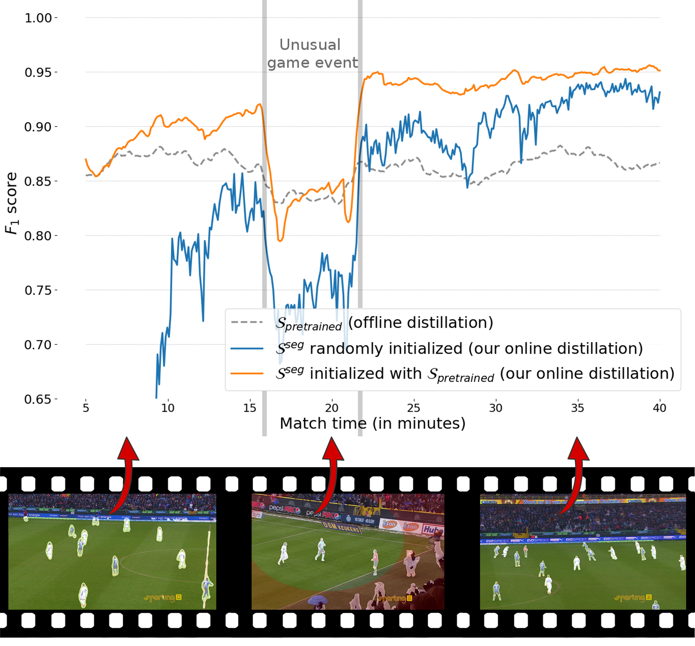
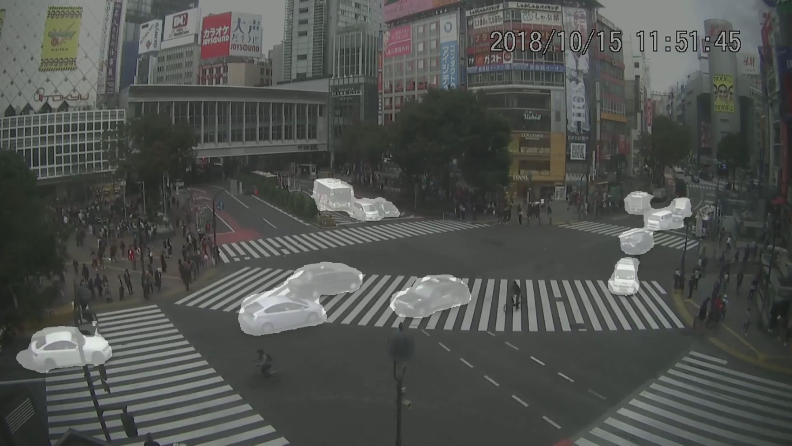
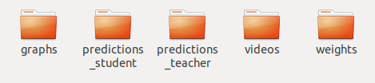
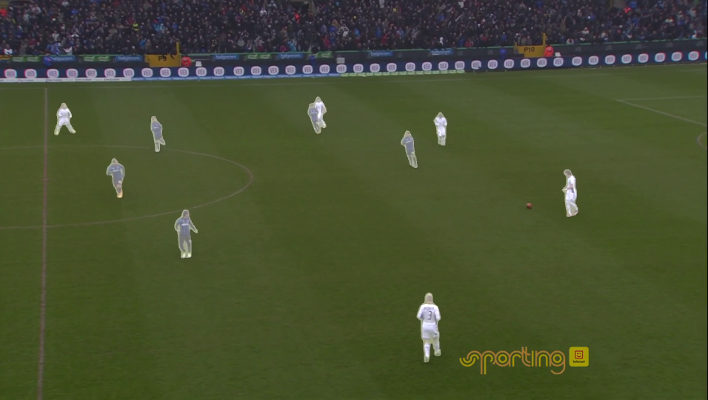

# ARTHuS: Adaptive Real-Time Human Segmentation in sports

This repository provides a benchmarking code as well as a multi-process real-time version of the method **ARTHuS** in Python 3 using the *PyTorch* deep learning framework. This work was presented at the [5th International Workshop on Computer Vision in Sports](http://www.vap.aau.dk/cvsports/?page_id=972) (CVsports), at the 2019 CVPR conference in Long Beach, California and won the best paper award of that workshop.

The paper can be found at the following public addresses: [Paper](http://openaccess.thecvf.com/content_CVPRW_2019/papers/CVSports/Cioppa_ARTHuS_Adaptive_Real-Time_Human_Segmentation_in_Sports_Through_Online_Distillation_CVPRW_2019_paper.pdf).

To cite this paper or repository, please use the following bibtex entry:
```bibtex
@InProceedings{Cioppa2019ARTHuS,
  author = {Cioppa, Anthony and Deliège, Adrien and Istasse, Maxime and De Vleeschouwer, Christophe and Van Droogenbroeck, Marc},
  title = {ARTHuS: Adaptive Real-Time Human Segmentation in Sports through Online Distillation},
  booktitle = {The IEEE Conference on Computer Vision and Pattern Recognition (CVPR) Workshops},
  month = {June},
  year = {2019}
}
```

### Short description of ARTHuS

ARTHuS is a semantic segmentation method which uses the novel concept of **Online Knowledge Distillation**. In the paper, ARTHuS is presented in a sports context (soccer and basket-ball). The goal of ARTHuS is to produce segmentation networks that keep on learning throughout the match without the need for manual annotations. This principles can be applied for other types of videos such as, for example, pedestrian or car segmentation in long video sequences.

The first important component of ARTHuS is a student network that segments humans in a particular soccer video. This network, called TinyNet, is lightweight in order to work in real-time. Its weights are regularly updated to adapt to the latest game conditions and to ensure a good generalization on the current video. This process, that we call online knowledge distillation, takes place in parallel to the segmentation.

To do so, we subsample the original video at a lower frame rate and compute high quality segmentation masks using a massive teacher network, Mask R-CNN in our case, which is not real-time. We use these masks as an approximate ground truth and store them in an online dataset. This dataset is used to train a copy of the student network. At each epoch, the dataset used for training is updated with new images coming from the teacher and older ones removed. Finally, the weights of the student performing the real time segmentation are updated.


## Information about this repository

In this repository, we provide two means of testing ARTHuS. 

1) A benchmarking code to compute the evolution of the performance, compare this performance with any fixed network weight (to observe the advantages of the online distillation), and finally get the segmentation masks. This code is not meant to be real time and can be run on any type of GPU or server.
2) A multi-process real-time implementation of ARTHuS for practical applications running on at least one good GPU (recommended is 2-3 GPUs). Note that we implemented this code on a NVIDIA DGX-1 server, but we do believe that the real-time code can also run on other types of servers with at least one GPU able to perform the real-time segmentation of the student network. The performance of the remaining GPUs or CPUs will simply impact the update rate of the student network's weights.

This code and the network architecture are meant to take as input only Full-HD (1920x1080) videos. If your video resolution is different, you can either simply rescale your video beforehand (using FFMPEG for example), or change the student segmentation network's architecture by one of your own.

<p align="center"></p>

## Prerequisites

In this section, we describe the environment that needs to be installed to run ARTHuS. In our case, we used a nvidia-docker on a DGX-1 server.

### Installation on a nvidia-docker

If you are also using a nvidia-docker, you can create a nvidia-docker from the folowing base image: <code>pytorch:18.02-py3</code> which can be found at the following address: [NVIDIA](https://ngc.nvidia.com/catalog/containers/nvidia:pytorch/tags).


In our case we used the following commands to create the dockers. Note that you will need to replace */path/to/your/directory/* by the path to your home directory or the clone of this repository and *path/to/the/docker/image* by the path to the docker image. Note that you can select the GPUs to use by changing the indexes of the *NV_GPU* variable.

For the benchmarking code:

```
NV_GPU=0 nvidia-docker run --name ARTHuS_Benchmark -it --rm --shm-size=1g --ulimit memlock=-1 -v /path/to/your/directory/:/workspace/generic path/to/the/docker/image
```

For the real-time code:

```
NV_GPU=0,1,2 nvidia-docker run --name ARTHuS_Real_Time -it --rm --shm-size=1g --ulimit memlock=-1 -v /path/to/your/directory/:/workspace/generic path/to/the/docker/image
```


Then, from the home directory of this repository, you can simply use the bash script provided to install all libraries automatically.

```
bash docker_install.sh
```

Not that for the benchmarking code, 1 GPU is enough. For the real-time code, we suggest to use 2-3 GPUs.
 
### Installation in any environment

If you are not using docker, here are the required libraries and their versions below.

Cuda version:
```
Cuda compilation tools, release 9.0, V9.0.176
```

The following python libraries have to be installed, the version of the library used in our setup is also specified:
```
Python (version >= 3.5.2)

python3 -m pip install --upgrade pip
python3 -m pip install numpy==1.16.3
python3 -m pip install torch==1.0.1.post2
python3 -m pip install torchvision==0.2.2
python3 -m pip install tqdm==4.23.1
python3 -m pip install matplotlib==3.0.3
python3 -m pip install opencv-python-headless==4.1.2.30
python3 -m pip install opencv-contrib-python-headless==4.1.2.30
python3 -m pip install natsort==6.0.0
python3 -m pip install imgaug==0.2.8
python3 -m pip install cython==0.29.7
python3 -m pip install ninja==1.9.0
python3 -m pip install yacs
python3 -m pip install ipython
python3 -m pip install scikit-image
```

Python2 libraries are needed to install external libraries (included in the repository).

```
Python (version >= 2.7.12)

python2 -m pip install --upgrade pip
python2 -m pip install numpy==1.16.3
python2 -m pip install matplotlib==2.2.4
python2 -m pip install cython==0.29.7
python2 -m pip install ninja==1.9.0
python2 -m pip install yacs 
python2 -m pip install ipython

```

Then, you will need to install the external libraries in the <code>external_libraries</code> folder: [COCO API](https://github.com/cocodataset/cocoapi)), [vision](https://github.com/pytorch/vision) and [Mask R-CNN](https://github.com/facebookresearch/maskrcnn-benchmark).

```
cd external_libraries

cd cocoapi/PythonAPI/
make
python3 setup.py build_ext install

cd ../../
cd vision/
python3 setup.py install

cd ../
cd maskrcnn-benchmark
python3 setup.py build develop

cd ../
python3 setup_maskrcnn.py
cd ../
```

## Test videos

Due to copyright issues, we cannot publicly provide the original soccer and basketball videos used in the paper. Therefore, we suggest you use your own videos if you wish to use ARTHuS in the same context as we did in the paper. 

As specified in the paper, the videos that you use should be long enough to clearly observe the effect of the online distillation and be able to see the performance plateau at some point. We suggest to use videos at least one hour long.

To overcome the issue of having to find long enough videos on your own, we share a one of a Japanese crossing junction which can be shared under a [Creative Commons 3.0 Licence](https://creativecommons.org/licenses/by/3.0/). The original 1 hour videos come from [Archive.org](https://archive.org/details/livecam-japan1-20181015/livecam-japan1-20181015-220000.mp4) and were concatenated into a single 3 hours long video. We tested our code for vehicule segmentation using this video and got very interesting results as well. To switch from human to vehicle segmentation, simply use the <code>-c 3 -c 4 -c 6 -c 8</code> argument in the following command lines (see [index_class_maskrcnn](index_class_maskrcnn.txt)).

Link to the video: [japanese crossing junction video](https://drive.google.com/open?id=1UJg42qUXJpessi1eJLaTE1DNt1h2in1L).


<p align="center"></p>


## Running the code


Whether you are interested in the benchmarking or the real-time code, you can start by creating a folder for saving the results. When either code is ran, it automatically creates a subfolder each time you run an experiment with a different index to avoid erasing existing results (*experiment_1*, *experiment_2*, ...). Each of these repositories will contain 4 (or 5) subfolders for saving the different results:
1. **graphs**, to save the graphs of the performances of ARTHuS. (only for the benchmarking code)
2. **predictions_student**, to save the masks produced by the student network. The masks will be saved as mask_0.png, mask_1.png,...
3. **predictions_teacher**, to save the sub-sampled segmentation masks, the field masks and the original images processed by the teacher. Saved as mask_0.png, field_0.png, original_0.png, mask_1.png, field_1.png, original_1.png, ...
4. **videos**, to save the final overlay video of the segmentation over the original video.
5. **weights**, to save the weights of the student network. Saved as weights_0_index.pt, weights_1_index.pt,... or weights_0.pt, weights_1.pt,... (The "index" is only useful in the benchmarking code for evaluating the results.

<p align="center"></p>

### Benchmarking code

To run the code, go to the benchmark folder.

```
cd benchmark
```

Then, you can run the training of the student network. This code will first compute and store all sub-sampled images for the teacher and compute the segmentation. These images will then be used to train the student network in an online fashion and the weights of each epochs are stored in the **weights** folder for the next step. The graphs of the performances will also be stored in the **graph** folder.

In its simplest form, the code can be run using the following command line. The network will be trained from scratch on your video located at *path/to/your/video/* and the results will be saved to the *path/to/your/save/folder/* folder. Also, the evaluation borders will be of size (3,3) pixels - (inner border, outer border), see the paper for more details.

```
python3 performance_benchmark.py -i path/to/your/video/ -s path/to/your/save/folder/ -b 3 3
```

If you want to start from a pre-trained network, add the <code>-w path/to/initial/weights</code> argument to all command lines. If you wish to use our initial weights for soccer players, use <code>-w networks/weights/weights_baseline_tinynet.dat</code>. If the video is for soccer from the main camera, you can use the <code>--onfield 1</code> argument. This will use the method presented in this [paper](https://www.researchgate.net/publication/325909052_A_Bottom-Up_Approach_Based_on_Semantics_for_the_Interpretation_of_the_Main_Camera_Stream_in_Soccer_Games) for determining the soccer field and excluding persons outside of the field (such as the public or the bodyguards) in the teacher segmentation. If you want to segment another class than the player class, you can change the <code>-c 1</code> argument to another class (merge multiple classes by specifying <code>-c 1 -c 2 -c 5 ...</code>). The classes index correspond to the Mask R-CNN classes order (see [index_class_maskrcnn](index_class_maskrcnn.txt)).

Then, to get the segmentation masks, run the following command. This will save all masks in the predictions_student folder.

```
python3 segmentation_benchmark.py -i path/to/your/video/ -s path/to/your/save/folder/
```

In order to have an overlay of the mask and the video, you can use the ffmpeg library. 
```
ffmpeg -i path/to/your/video/ -i path/to/your/save/folder/predictions_student/mask_%d.png -filter_complex "[1]format=yuva444p,colorchannelmixer=aa=0.35[in2];[0][in2]overlay" -pix_fmt yuv420p -c:a aac -strict -2 -ac 2 -b:a 256k -c:v libx264 -preset slow -tune film -crf 19 path/to/your/save/folder/videos/student_overlay.mp4
```

Finally, if you wish to evaluate the performance of the initial weights, simply run the following command line. The <code>-p</code> parameter should point to the dataset of the video on which you wish to evaluate the network. Typically, it is located in the **predictions_teacher** folder of one of your previous experiments (created by the performance_benchmark code).

```
python3 performance_offline.py -i path/to/your/video/ -s path/to/your/save/folder/ -b 3 3 -w path/to/initial/weights -p path/to/your/save/folder/experiment_X/predictions_teacher/
```

<p align="center"></p>

### Real-time code for ARTHuS

For the real-time applications, we provide a code for running ARTHuS in a multi-process way.
The multi-process real-time code for ARTHuS can be run in its simplest setting from the src folder using the following command:

```
cd src

python3 main.py -i path/to/your/video/ -s path/to/your/save/folder/ -w path/to/initial/weights
```

This will save all masks in the predictions_student folder, the weights in the weights folder and the Mask R-CNN predictions produced in the predictions_teacher folder. The code is slowed down to run at the input frame rate, which is supposed to be 25 fps

### Some tests on the load capacity of your server

We also provide a test code for the CPU-GPU transfer time on your server using:
```
From the test folder
python3 timing_cpu_gpu_transfers.py -i "filepath to the video to segment in real-time"
```

And the a test code for the time it takes to transfer images from one process to another using:
```
From the test folder
python3 timing_queue_transfer.py -i "filepath to the video to segment in real-time" -s path to the folder for saving the results"
```

## Authors

See the [AUTHORS](AUTHORS) file for details.


## License

AGPLv3

See the [LICENSE](LICENSE) file for details.

__External libraries__

* cocoAPI: Permissive custom License
* Maskrcnn-benchmark: MIT License
* vision: BSD 3-Clause License

See the [LICENSE](LICENSE) file for details.

## Acknowledgments

* Anthony Cioppa is funded by the FRIA, Belgium.
* This work is supported by the DeepSport project of the Walloon Region, at the University of Liège (ULiège) and University of Louvain (ULouvain), Belgium.
